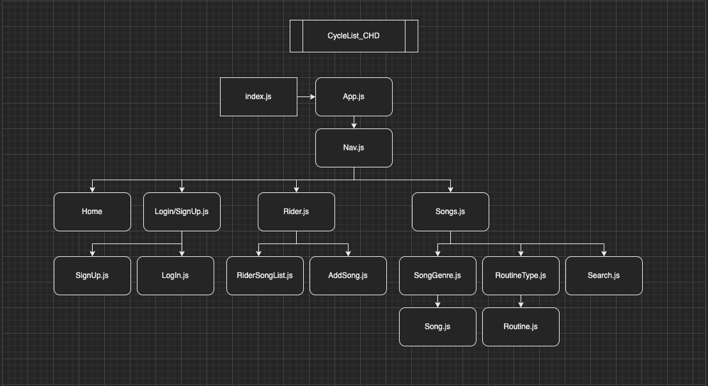
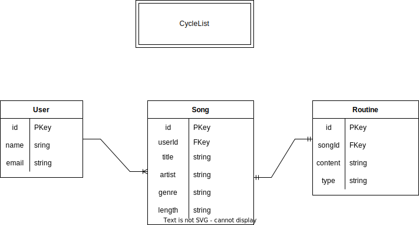
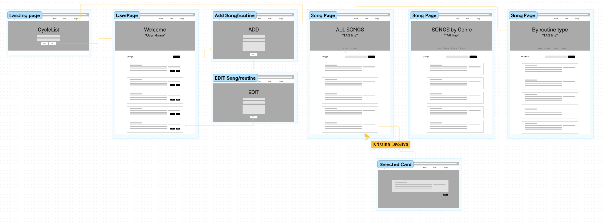

# CycleList
## 8/11/2022
### By: [Eric Deleon](https://github.com/132E), [Jeff Fraley](https://github.com/frank-booth), [Kristina DeSilva](https://github.com/kavdesilva)

***

### *Description*
#### A website for spin instructors and novices to help build indoor cycle workouts. The rider will be able to include their favorite songs with their routines for a customized, personal workout.

***

### [CycleList link]()

***

### *Languages*
* Sequelize
* Express
* React
* Node.js

***

### *Trello Board*
#### [Project Three - "CycleList"](https://trello.com/b/1N4S1Jx8/cyclelist)

***

### *Component Heirarchy Diagram (CHD)*

***

### *Entity Relationship Diagram (ERD)*

***

### *Wireframes*

***

### *Future Updates*
- [x] README.md
- [x] Trello Board
- [x] Wireframes
- [x] ERD
- [x] CHD
- [x] Books Database
- [ ] Frontend
- [ ] Backend
- [ ] Heroku Deployment

### *Post-MVP*
- [ ] Playlist Functionality
- [ ] Login Authentication

***

### *Credits*
#### [JollySpins](https://jollyspins.wordpress.com/)